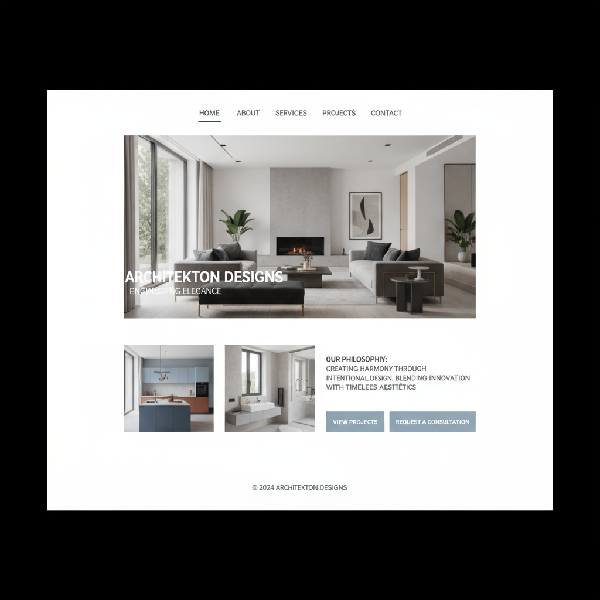
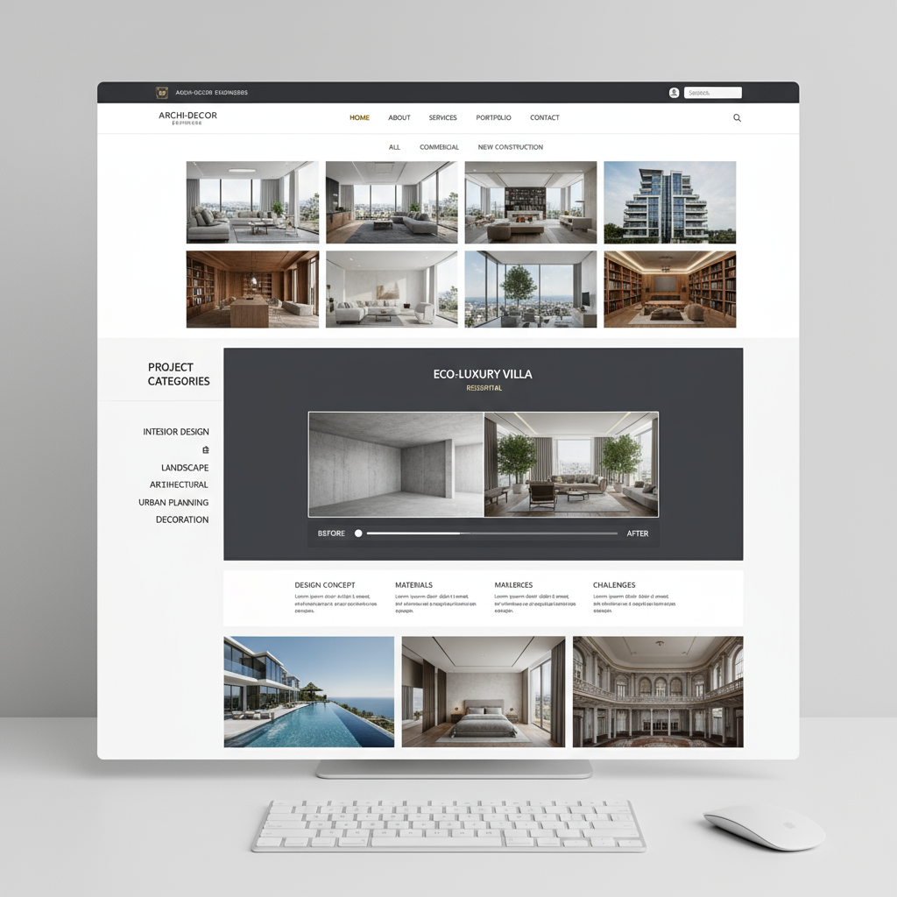
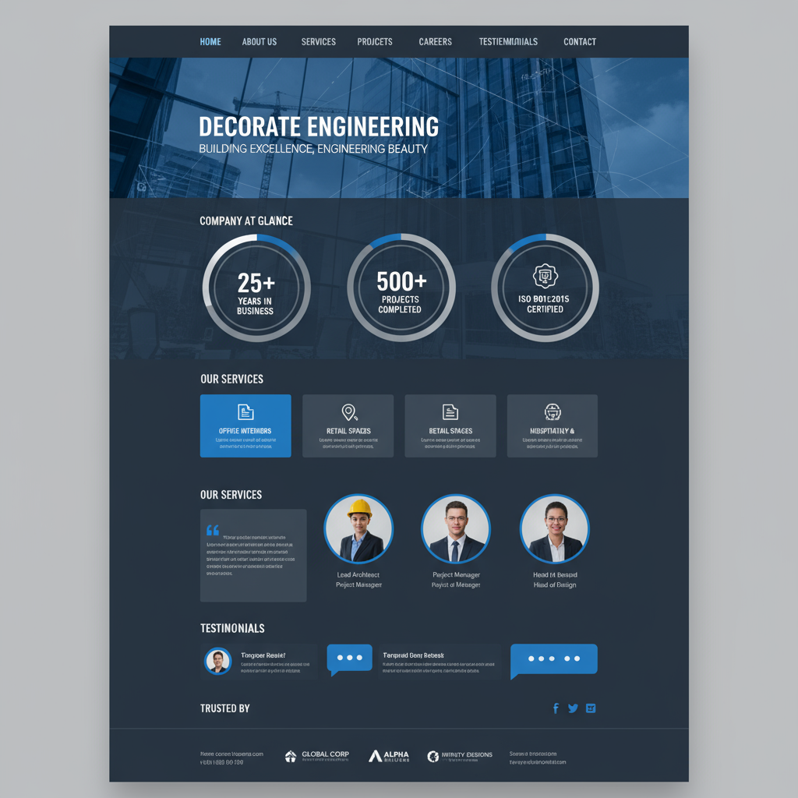
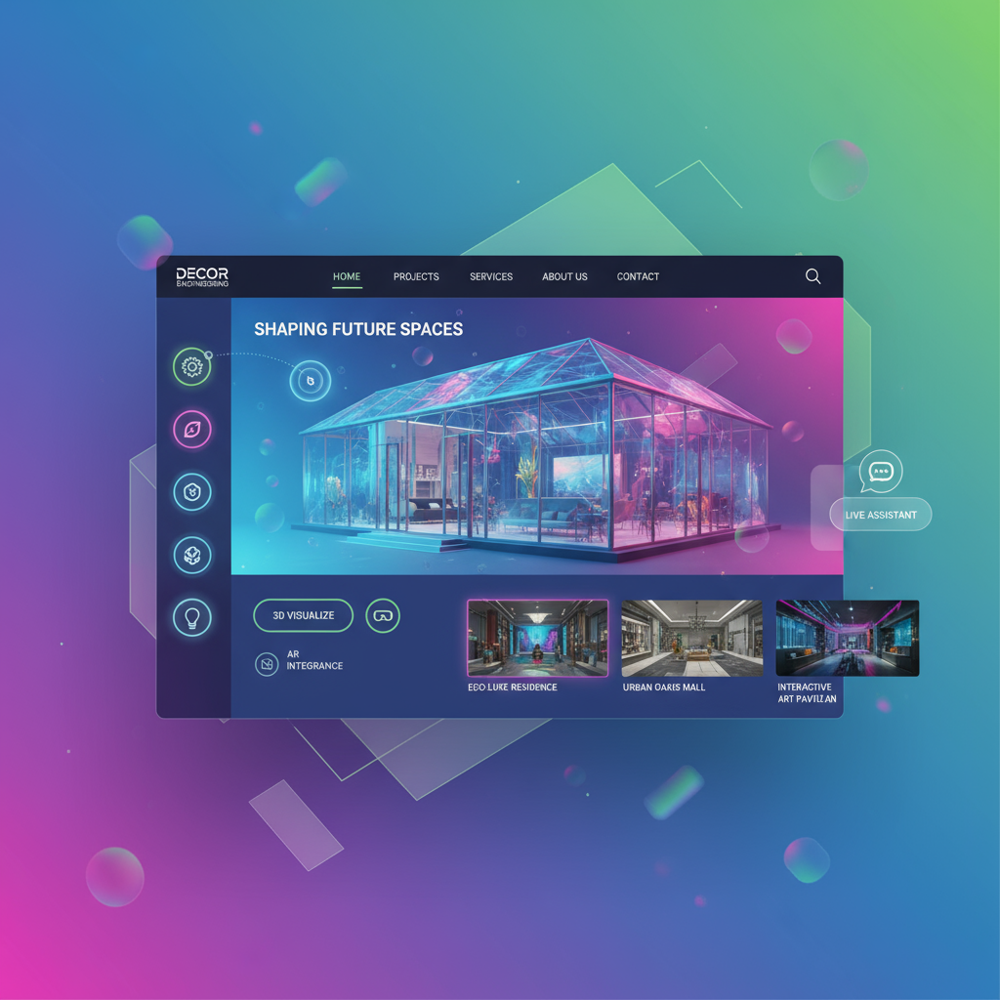

# Decoration Engineering Website Reference Guide

## Executive Summary

This guide provides a comprehensive framework for decoration engineering companies to create a powerful online presence. It synthesizes extensive research on industry best practices, competitor analysis, and user experience trends to deliver actionable recommendations for website development. 

The key findings indicate that a successful decoration engineering website must prioritize a visual-first approach, showcasing high-quality project imagery within a clean, professional design. Trust signals, such as client testimonials, certifications, and detailed team information, are critical for building credibility. Navigation should be structured and intuitive, accommodating the complex service offerings of the industry.

This guide presents four distinct website design proposals, each with detailed specifications and visual mockups, to cater to different market positions: Modern Minimalist, Portfolio-Focused, Corporate Professional, and Interactive Showcase. It also includes a detailed implementation roadmap covering technical requirements, budget and timeline planning, and success metrics. 

By following the recommendations in this guide, decoration engineering companies can develop a website that not only serves as a stunning portfolio but also functions as a powerful business development tool, driving client acquisition and reinforcing brand leadership in the digital landscape.

## PART 1: INDUSTRY ANALYSIS

### Synthesis of Successful Decoration Engineering Website Analysis

An analysis of 10 leading decoration engineering and architecture firms, including both established global players and innovative modern studios, revealed a consistent set of design patterns and best practices that underpin their online success. These websites effectively balance aesthetic appeal with the need to communicate technical expertise and build client trust.

**Key Design Patterns:**

*   **Visual-First Approach**: All successful firms utilize high-quality, professional photography and videography as the primary means of communication. Project imagery is not just a gallery feature; it is the core of the user experience, often integrated directly into the homepage and service pages.
*   **Professional Minimalism**: The prevailing design aesthetic is clean, uncluttered, and minimalist. This approach uses a neutral color palette and ample white space to ensure that the project visuals are the main focus.
*   **Hierarchical and Intuitive Navigation**: Given the complexity of services offered, successful websites employ clear, hierarchical navigation structures. This often includes multi-tiered dropdown menus and dedicated sections for services, markets, and projects, allowing users to easily find relevant information.
*   **Prominent Trust Signals**: To build credibility in a high-stakes industry, leading firms prominently display trust signals. These include client testimonials, industry awards, professional certifications, and detailed team biographies.
*   **Responsive and Mobile-First Design**: Recognizing that a significant portion of traffic comes from mobile devices, all successful websites are fully responsive and optimized for a seamless experience across all screen sizes.

### Industry Requirements and Best Practices

The decoration engineering industry has a unique set of requirements for its websites, driven by the B2B nature of the business and the importance of visual proof of capability.

*   **Portfolio Showcase**: The portfolio is the most critical component of a decoration engineering website. Best practices include:
    *   **High-Resolution Imagery**: Professional, high-resolution "before and after" photos and videos are essential.
    *   **Detailed Project Narratives**: Each project should be accompanied by a detailed description of the challenges, solutions, and outcomes.
    *   **Advanced Filtering**: Users should be able to filter projects by service, industry, location, and other relevant criteria.
*   **Client Testimonials and Case Studies**: Social proof is a powerful tool for building trust. Websites should feature detailed case studies and testimonials that connect client satisfaction to specific projects.
*   **Clear Service Descriptions**: While visuals are key, they must be supported by clear and detailed descriptions of the services offered. This includes outlining the process, materials, and technical specifications.
*   **Team Presentation**: A professional "Meet the Team" page that showcases the expertise and experience of key personnel is a powerful trust-building element.
*   **Industry-Specific Functionality**: Features such as client portals for project tracking, 3D visualization tools, and material calculators can provide significant value and differentiate a firm from its competitors.

### Key Trends and Insights

*   **Content Marketing**: Leading firms are increasingly using their websites as content marketing platforms, publishing blog posts, white papers, and industry insights to demonstrate their expertise and attract organic traffic.
*   **Video Content**: The use of video is on the rise, with firms using video walkthroughs, drone footage, and client testimonials to create a more immersive and engaging user experience.
*   **Interactive Elements**: Interactive elements, such as 3D models, interactive floor plans, and cost calculators, are becoming more common as firms seek to provide more value to their website visitors.
*   **Personalization**: Some firms are beginning to experiment with personalization, tailoring the website experience to the user's industry or interests.

## PART 2: WEBSITE REFERENCE PROPOSALS

This section presents four distinct website design proposals, each tailored to a specific market position and business strategy. These proposals are based on the analysis of industry best practices and competitor websites, providing a solid foundation for any decoration engineering company.

### Proposal 1: Modern Minimalist Design

**Concept**: This design is for the firm that wants to project an image of sophistication, elegance, and design-forward thinking. It is ideal for companies targeting high-end residential and commercial clients who value a strong aesthetic.

**Visual Approach**: The design is characterized by a clean, uncluttered layout, extensive use of white space, and a monochromatic color palette. The focus is on large, high-impact project images and elegant typography.

**Key Features**:

*   **Homepage**: A full-screen hero image of a stunning project, with minimal text and a clean navigation bar.
*   **Portfolio**: A grid-based layout with large thumbnails and a subtle hover effect that reveals the project title.
*   **Services**: A simple, text-based page with a clear and concise description of each service.
*   **About Us**: A focus on the firm's design philosophy and the profiles of key team members.

### Proposal 2: Portfolio-Focused Layout

**Concept**: This design is for the firm that wants to let its work speak for itself. It is ideal for companies with a large and diverse portfolio of projects.

**Visual Approach**: The design is highly visual, with a focus on showcasing as many projects as possible. The layout is a dynamic, masonry-style grid that encourages exploration.

**Key Features**:

*   **Homepage**: A dynamic grid of project images that fills the entire screen. A persistent navigation bar provides access to other sections of the site.
*   **Portfolio**: The core of the site, with advanced filtering options that allow users to sort projects by service, industry, and location.
*   **Project Pages**: Detailed case studies for each project, with a gallery of images, a description of the work, and a client testimonial.
*   **Services**: Service pages are integrated with the portfolio, showcasing relevant projects for each service.

### Proposal 3: Corporate Professional Style

**Concept**: This design is for the established firm that wants to project an image of trust, reliability, and expertise. It is ideal for companies targeting large corporate and institutional clients.

**Visual Approach**: The design is clean, professional, and conservative. The color palette is typically blue and gray, and the layout is structured and easy to navigate.

**Key Features**:

*   **Homepage**: A traditional corporate homepage with a hero image, a clear value proposition, and sections for services, projects, and news.
*   **Services**: Detailed service pages that outline the firm's capabilities and experience.
*   **About Us**: A comprehensive section with information about the firm's history, leadership, and values.
*   **Trust Signals**: The design prominently features trust signals such as client logos, awards, and certifications.

### Proposal 4: Interactive Showcase Format

**Concept**: This design is for the innovative firm that wants to showcase its creativity and technical expertise. It is ideal for companies that want to create a memorable and engaging user experience.

**Visual Approach**: The design is modern, dynamic, and interactive. It uses video, animation, and other interactive elements to bring the firm's projects to life.

**Key Features**:

*   **Homepage**: A full-screen video background or an interactive 3D model of a project.
*   **Portfolio**: An immersive portfolio with video walkthroughs, interactive floor plans, and other engaging elements.
*   **Services**: Service pages that use animation and infographics to explain the firm's process.
*   **About Us**: A creative and engaging "Meet the Team" page with video interviews and other interactive content.

### Comparison Matrix and Decision Framework

| Proposal | Target Audience | Market Positioning | Key Features |
| --- | --- | --- | --- |
| **Modern Minimalist** | High-end residential & commercial | Design-forward, exclusive | Elegant typography, large images, white space |
| **Portfolio-Focused** | Clients with large, diverse projects | Experienced, versatile | Advanced filtering, detailed project pages, masonry grid |
| **Corporate Professional** | Large corporate & institutional clients | Trusted, reliable, expert | Prominent trust signals, detailed service pages, structured layout |
| **Interactive Showcase** | Clients seeking innovation & creativity | Innovative, cutting-edge | Video, animation, 3D models, interactive elements |

To choose the right proposal, a decoration engineering company should consider its target audience, market positioning, and business goals. The following questions can help guide the decision-making process:

*   Who are our ideal clients?
*   How do we want to be perceived in the market?
*   What are the key messages we want to communicate?
*   What is our budget and timeline for the project?

## PART 3: IMPLEMENTATION ROADMAP

This section provides a step-by-step guide for implementing a new website, from planning and design to launch and maintenance.

### Step-by-Step Implementation Guidance

**Phase 1: Planning and Discovery (Weeks 1-2)**

*   **Define Goals and Objectives**: Clearly define the goals of the new website. Is it to generate leads, showcase the portfolio, or build brand awareness?
*   **Identify Target Audience**: Create detailed personas for the ideal clients.
*   **Analyze Competition**: Review the websites of key competitors to identify their strengths and weaknesses.
*   **Choose a Design Direction**: Select one of the four proposals outlined in this guide.

**Phase 2: Design and Content Creation (Weeks 3-6)**

*   **Wireframing and Prototyping**: Create a detailed blueprint of the website, including the layout of each page and the user flow.
*   **Visual Design**: Develop a visual design that is consistent with the chosen design direction and the company's brand.
*   **Content Creation**: Write the copy for each page and gather all the necessary images and videos.

**Phase 3: Development and Testing (Weeks 7-10)**

*   **Development**: Build the website using a content management system (CMS) such as WordPress, Drupal, or a headless CMS.
*   **Testing**: Thoroughly test the website to ensure that it is free of bugs and that it works correctly on all devices and browsers.

**Phase 4: Launch and aintenance (Weeks 11-12 and beyond)**

*   **Launch**: Deploy the website to a live server.
*   **Maintenance**: Regularly update the website with new content, and monitor its performance to identify any issues.

### Technical Requirements and Considerations

*   **Content Management System (CMS)**: A robust and flexible CMS is essential for managing the website's content.
*   **Hosting**: A reliable hosting provider is necessary to ensure that the website is always available and that it loads quickly.
*   **Analytics**: A web analytics tool such as Google Analytics is crucial for tracking the website's performance and identifying areas for improvement.
*   **Security**: The website must be secure to protect it from hackers and other threats.

### Budget and Timeline Planning

The budget and timeline for a new website will vary depending on the scope of the project. However, a typical project can take anywhere from 3 to 6 months and cost between $25,000 and $100,000.

### Success Metrics and KPIs

*   **Website Traffic**: The number of visitors to the website.
*   **Bounce Rate**: The percentage of visitors who leave the website after viewing only one page.
*   **Conversion Rate**: The percentage of visitors who take a desired action, such as filling out a contact form or subscribing to a newsletter.
*   **Search Engine Rankings**: The website's position in the search engine results pages (SERPs) for relevant keywords.

## PART 4: ACTIONABLE RECOMMENDATIONS

This section provides specific, actionable recommendations for decoration engineering companies to improve their online presence.

### Specific Next Steps for Different Business Scenarios

*   **For the new firm**: Start with the "Modern Minimalist" proposal to create a professional and polished online presence with a limited budget.
*   **For the growing firm**: Consider the "Portfolio-Focused" proposal to showcase a growing body of work and attract larger clients.
*   **For the established firm**: The "Corporate Professional" proposal can help to reinforce a position of leadership and trust in the market.
*   **For the innovative firm**: The "Interactive Showcase" proposal can help to differentiate the firm from its competitors and attract clients who are looking for a creative and cutting-edge partner.

### Content Strategy Guidelines

*   **Publish high-quality content regularly**: This will help to attract new visitors to the website and keep them coming back.
*   **Focus on topics that are relevant to your target audience**: Write about the latest trends in decoration engineering, share your expert advice, and showcase your most impressive projects.
*   **Promote your content on social media**: This will help to drive traffic to your website and build your brand awareness.

### Maintenance and Optimization Recommendations

*   **Keep your website up to date**: Regularly update your website with new content, and make sure that it is always running smoothly.
*   **Monitor your website's performance**: Use a web analytics tool to track your website's traffic, bounce rate, and conversion rate. This will help you to identify any problems and make the necessary improvements.
*   **Continuously optimize your website for search engines**: This will help to ensure that your website is visible to potential clients who are searching for decoration engineering services online.

## Sources

[1] [The Ultimate Guide to Contractor Website Must-Haves](https://farmboyinc.com/the-ultimate-guide-to-contractor-website-must-haves/) - High Reliability - Comprehensive contractor website guide from established industry resource

[2] [10 Must-Have Features for Construction Websites in 2025](https://nilead.com/article/must-have-features-for-construction-websites) - High Reliability - Current industry analysis with statistics and best practices

[3] [8 Trust Signals You Need to Have on Your Website](https://www.webstacks.com/blog/trust-signals) - High Reliability - Comprehensive guide to trust signals for websites.

[4] [Website Navigation Design: Everything You Need to Know](https://www.trajectorywebdesign.com/blog/website-navigation-design-guide) - High Reliability - Detailed navigation design guide.

[5] [The 15 best 'Meet the Team' pages I've ever seen](https://blog.hubspot.com/marketing/creative-agency-team-pages) - High Reliability - Examples of effective 'Meet the Team' pages.

[6] [Engineering Websites: 10 Web Design Tips + 30 Examples](https://openasset.com/resources/engineering-website-examples/) - High Reliability - Comprehensive guide with 10 web design tips and 30 engineering firm website examples.

[7] [Gensler - Global Architecture, Design, and Planning Firm](https://www.gensler.com/) - High Reliability - Global architecture firm with comprehensive design patterns analysis including navigation structure, layout approach, and visual hierarchy

[8] [Colliers Engineering & Design - Multidiscipline Engineering and Architecture](https://colliersengineering.com/) - High Reliability - Comprehensive analysis of website structure, design elements, and service presentation methods

[9] [CannonDesign - Architecture, Engineering, Construction, Strategy](https://www.cannondesign.com/) - High Reliability - Living-Centered Design approach analysis including layout patterns, navigation systems, and visual elements

[10] [Design Collaborative - Architects, Engineers, Interior Designers](https://designcollaborative.com/) - High Reliability - Multidisciplinary firm analysis of hierarchical structure, navigation patterns, color palette usage, and project showcase methods  

[11] [Studio McGee - Interior Design & Home Decor](https://studio-mcgee.com/) - High Reliability - Modern interior design firm analysis of sophisticated visual-driven design and grid-based layouts

[12] [Zaha Hadid Architects - International Architecture Firm](https://www.zaha-hadid.com/) - High Reliability - Luxury architecture website analysis including sophisticated design approach and professional UX elements

[13] [HDR - Employee-Owned Professional Services Firm](https://www.hdrinc.com/) - High Reliability - Professional design approach analysis including layout patterns, navigation systems, and user experience elements

[14] [Minale + Mann - Architecture and Interior Design Studio London](https://minaleandmann.com/) - High Reliability - Award-winning London studio analysis including modern interface elements and structured service presentation

[15] [Studio Gang - Architecture and Urban Design Practice](https://studiogang.com/) - High Reliability - Innovative architectural firm analysis including modern layout patterns and cutting-edge UX elements

[16] [BIG - Global Architecture Firm](https://big.dk/) - High Reliability - Danish architecture firm analysis featuring minimalist design and innovative project presentation methods
